# Test Cases для TodoApp

Документ содержит ручные тест-кейсы для проверки консольного приложения TodoApp.  
Перед проверкой рекомендуется запускать приложение из папки решения командой:

```powershell
dotnet run --project .\TodoApp\TodoApp.csproj
```

Скриншоты выполнения тестов находятся в папке [Screenshots](Screenshots).

## Пользователи и авторизация

### TC-01 Создание нового пользователя
**Описание:** Проверка создания нового профиля пользователя.

**Предусловия:** Приложение запущено. Пользователь не авторизован.

**Последовательность действий:**
1. На вопрос `Войти в существующий профиль? [y/n]` ввести `n`.
2. Ввести логин `test_user_01`.
3. Ввести пароль `12345`.
4. Ввести имя `Ivan`.
5. Ввести фамилию `Ivanov`.
6. Ввести год рождения `2000`.

**Ожидаемый результат:**
- Пользователь создан.
- Пользователь автоматически авторизован.
- В консоли отображается приветствие.
- Профиль сохраняется в базе `todos.db`.

**Скриншоты:**
- 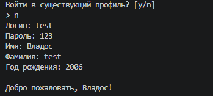

### TC-02 Авторизация пользователя
**Описание:** Проверка входа в ранее созданный профиль.

**Предусловия:** В базе есть профиль `test_user_01`.

**Последовательность действий:**
1. Запустить приложение.
2. На вопрос входа ввести `y`.
3. Ввести логин `test_user_01`.
4. Ввести пароль `12345`.

**Ожидаемый результат:**
- Пользователь успешно авторизован.
- Отображается приветствие.
- Доступны команды работы с задачами.

**Скриншоты:**
- 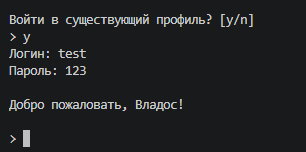

### TC-03 Ошибка авторизации
**Описание:** Проверка реакции на неверный пароль.

**Предусловия:** В базе есть профиль `test_user_01`.

**Последовательность действий:**
1. Запустить приложение.
2. Ввести `y`.
3. Ввести логин `test_user_01`.
4. Ввести пароль `wrong`.

**Ожидаемый результат:**
- Пользователь не авторизован.
- В консоли отображается ошибка авторизации.
- Программа не завершается аварийно.

**Скриншоты:**
- 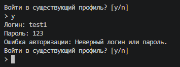

### TC-04 Выход из текущего пользователя
**Описание:** Проверка команды выхода из профиля.

**Предусловия:** Пользователь авторизован.

**Последовательность действий:**
1. Ввести команду `profile -o`.

**Ожидаемый результат:**
- Текущий профиль сброшен.
- В консоли отображается сообщение о выходе.
- При следующем шаге приложение снова предлагает вход или регистрацию.

**Скриншоты:**
- 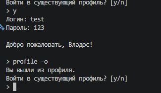

### TC-05 Повторная авторизация после выхода
**Описание:** Проверка входа после выполнения `profile -o`.

**Предусловия:** Пользователь вышел из профиля.

**Последовательность действий:**
1. На вопрос входа ввести `y`.
2. Ввести логин `test_user_01`.
3. Ввести пароль `12345`.

**Ожидаемый результат:**
- Пользователь повторно авторизован.
- Ранее сохранённые задачи доступны.

**Скриншоты:**
- 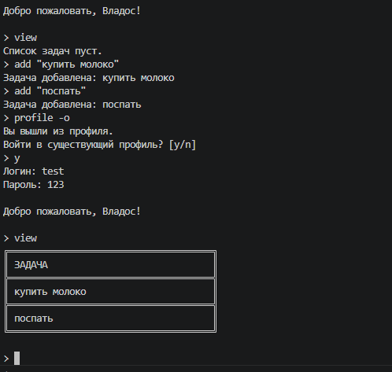

### TC-06 Просмотр данных пользователя
**Описание:** Проверка команды просмотра текущего профиля.

**Предусловия:** Пользователь авторизован.

**Последовательность действий:**
1. Ввести команду `profile`.

**Ожидаемый результат:**
- В консоли отображается информация о текущем профиле.
- Данные соответствуют введённым при регистрации.

**Скриншоты:**
- 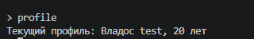

## Добавление задач

### TC-07 Добавление задачи с корректными данными
**Описание:** Проверка добавления обычной задачи.

**Предусловия:** Пользователь авторизован.

**Последовательность действий:**
1. Ввести команду `add "Купить молоко"`.

**Ожидаемый результат:**
- Задача добавлена.
- В консоли отображается сообщение об успешном добавлении.
- Статус новой задачи по умолчанию `NotStarted`.

**Скриншоты:**
- 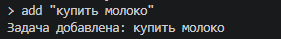

### TC-08 Добавление задачи с пустым названием
**Описание:** Проверка валидации пустого текста задачи.

**Предусловия:** Пользователь авторизован.

**Последовательность действий:**
1. Ввести команду `add ""`.

**Ожидаемый результат:**
- Задача не добавляется.
- В консоли отображается ошибка аргумента.
- Приложение продолжает работу.

**Скриншоты:**
- 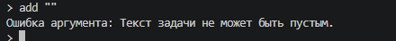

### TC-09 Добавление задачи с длинным текстом
**Описание:** Проверка добавления длинной задачи и её отображения.

**Предусловия:** Пользователь авторизован.

**Последовательность действий:**
1. Ввести команду `add "Очень длинная задача для проверки корректного сокращения текста при выводе в таблице"`.
2. Ввести команду `view -a`.

**Ожидаемый результат:**
- Длинная задача добавлена.
- В таблице текст отображается без поломки разметки.
- При необходимости текст сокращается.

**Скриншоты:**
- 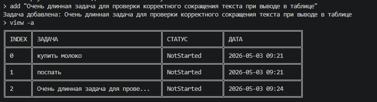

### TC-10 Добавление многострочной задачи
**Описание:** Проверка режима многострочного ввода.

**Предусловия:** Пользователь авторизован.

**Последовательность действий:**
1. Ввести команду `add -m`.
2. Ввести строку `Первая строка`.
3. Ввести строку `Вторая строка`.
4. Ввести `!end`.

**Ожидаемый результат:**
- Многострочная задача добавлена.
- Строки задачи сохранены.
- Команда `read` показывает полный текст.

**Скриншоты:**
- 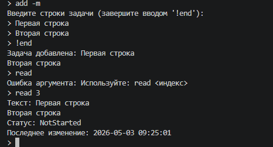

### TC-11 Добавление задачи со служебными символами
**Описание:** Проверка сохранения символов `/`, `;`, `|`, `\`, `:`.

**Предусловия:** Пользователь авторизован.

**Последовательность действий:**
1. Ввести команду `add "Проверка / ; | \ : символов"`.
2. Ввести команду `read 4`.

**Ожидаемый результат:**
- Задача добавлена без ошибок парсинга.
- Служебные символы отображаются в тексте задачи.

**Скриншоты:**
- 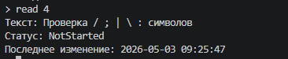

## Просмотр задач

### TC-12 Просмотр списка задач
**Описание:** Проверка команды `view`.

**Предусловия:** У текущего пользователя есть задачи.

**Последовательность действий:**
1. Ввести команду `view -a`.

**Ожидаемый результат:**
- Отображается таблица задач.
- Видны индекс, текст, статус и дата последнего изменения.

**Скриншоты:**
- 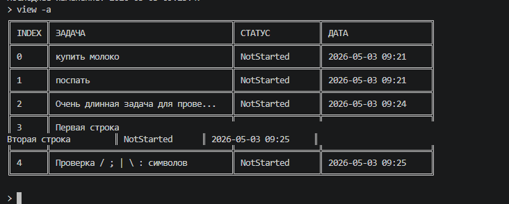

### TC-13 Просмотр задачи через read
**Описание:** Проверка отображения полной информации о задаче.

**Предусловия:** У текущего пользователя есть задача с индексом `0`.

**Последовательность действий:**
1. Ввести команду `read 0`.

**Ожидаемый результат:**
- Отображается полный текст задачи.
- Отображаются статус и дата последнего изменения.

**Скриншоты:**
- 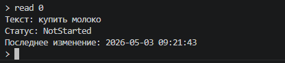

### TC-14 Просмотр задач при пустом списке
**Описание:** Проверка поведения `view`, если задач нет.

**Предусловия:** Создан новый пользователь без задач.

**Последовательность действий:**
1. Войти под новым пользователем.
2. Ввести команду `view -a`.

**Ожидаемый результат:**
- Программа сообщает, что список пуст.
- Ошибок выполнения нет.

**Скриншоты:**
- 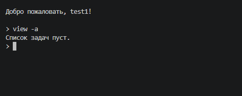

## Обновление задач

### TC-15 Обновление текста задачи
**Описание:** Проверка команды `update`.

**Предусловия:** У пользователя есть задача с индексом `0`.

**Последовательность действий:**
1. Ввести команду `update 0 "Купить хлеб"`.
2. Ввести команду `read 0`.

**Ожидаемый результат:**
- Текст задачи изменён.
- Дата последнего изменения обновлена.

**Скриншоты:**
- 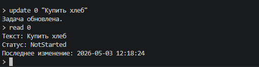

### TC-16 Обновление статуса задачи
**Описание:** Проверка команды `status`.

**Предусловия:** У пользователя есть задача с индексом `0`.

**Последовательность действий:**
1. Ввести команду `status 0 completed`.
2. Ввести команду `read 0`.

**Ожидаемый результат:**
- Статус задачи изменён на `Completed`.
- Дата последнего изменения обновлена.

**Скриншоты:**
- 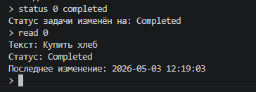

### TC-17 Попытка обновить несуществующую задачу
**Описание:** Проверка обработки неверного индекса.

**Предусловия:** Пользователь авторизован.

**Последовательность действий:**
1. Ввести команду `update 999 "Новый текст"`.

**Ожидаемый результат:**
- Программа выводит ошибку задачи.
- Данные не изменяются.
- Программа продолжает работу.

**Скриншоты:**
- 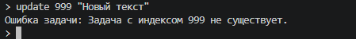

## Удаление задач

### TC-18 Удаление существующей задачи
**Описание:** Проверка команды `delete`.

**Предусловия:** У пользователя есть задача с индексом `0`.

**Последовательность действий:**
1. Ввести команду `delete 0`.
2. Ввести команду `view -a`.

**Ожидаемый результат:**
- Задача удалена.
- В списке она больше не отображается.

**Скриншоты:**
- 

### TC-19 Попытка удалить несуществующую задачу
**Описание:** Проверка обработки неверного индекса при удалении.

**Предусловия:** Пользователь авторизован.

**Последовательность действий:**
1. Ввести команду `delete 999`.

**Ожидаемый результат:**
- Программа выводит ошибку задачи.
- Список задач не изменяется.

**Скриншоты:**
- 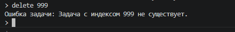

## Поиск задач

### TC-20 Поиск задачи по части строки
**Описание:** Проверка флага `--contains`.

**Предусловия:** Есть задача с текстом `Купить хлеб`.

**Последовательность действий:**
1. Ввести команду `search --contains "хлеб"`.

**Ожидаемый результат:**
- Отображаются задачи, содержащие слово `хлеб`.
- Результат выводится таблицей.

**Скриншоты:**
- 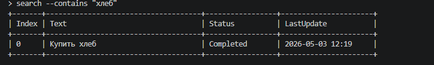

### TC-21 Поиск по первым и последним символам
**Описание:** Проверка флагов `--starts-with` и `--ends-with`.

**Предусловия:** Есть задачи с подходящим текстом.

**Последовательность действий:**
1. Ввести команду `search --starts-with "Купить"`.
2. Ввести команду `search --ends-with "хлеб"`.

**Ожидаемый результат:**
- Первый поиск выводит задачи, начинающиеся с `Купить`.
- Второй поиск выводит задачи, заканчивающиеся на `хлеб`.

**Скриншоты:**
- 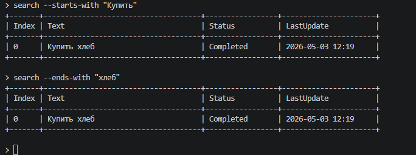

### TC-22 Поиск по датам
**Описание:** Проверка флагов `--from` и `--to`.

**Предусловия:** Есть задачи с датой последнего изменения в указанном диапазоне.

**Последовательность действий:**
1. Ввести команду `search --from 2024-01-01 --to 2030-01-01`.

**Ожидаемый результат:**
- Отображаются задачи, дата изменения которых входит в диапазон.

**Скриншоты:**
- 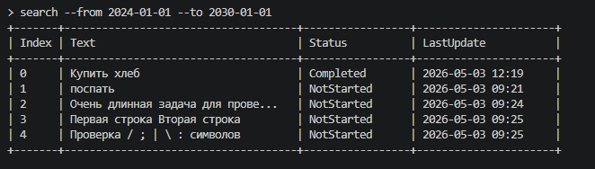

### TC-23 Поиск с сортировкой и top
**Описание:** Проверка сортировки и ограничения результата.

**Предусловия:** В списке есть не менее трёх задач.

**Последовательность действий:**
1. Ввести команду `search --sort text --top 2`.
2. Ввести команду `search --sort date --desc --top 2`.

**Ожидаемый результат:**
- В первом случае отображаются первые две задачи после сортировки по тексту.
- Во втором случае отображаются две последние изменённые задачи в порядке убывания даты.

**Скриншоты:**
- 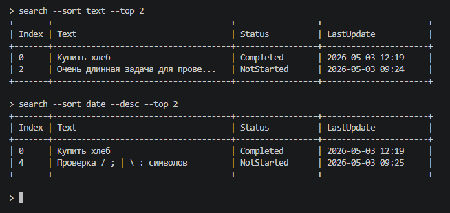

### TC-24 Поиск с комбинацией условий
**Описание:** Проверка одновременной работы нескольких фильтров.

**Предусловия:** Есть задачи со статусом `Completed`.

**Последовательность действий:**
1. Ввести команду `search --contains "Купить" --status completed --sort date --desc --top 5`.

**Ожидаемый результат:**
- Отображаются только задачи, удовлетворяющие всем условиям.
- Результат отсортирован по дате по убыванию.
- Выведено не больше пяти строк.

**Скриншоты:**
- 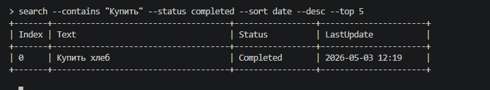

### TC-25 Поиск при отсутствии совпадений
**Описание:** Проверка сообщения при пустом результате.

**Предусловия:** Пользователь авторизован.

**Последовательность действий:**
1. Ввести команду `search --contains "строка-которой-нет"`.

**Ожидаемый результат:**
- В консоли отображается сообщение `Ничего не найдено`.
- Ошибок выполнения нет.

**Скриншоты:**
- 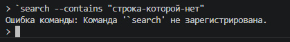

## Работа с файлами и базой данных

### TC-26 Сохранение данных после перезапуска
**Описание:** Проверка сохранения профиля и задач в SQLite.

**Предусловия:** Пользователь создал профиль и добавил задачу.

**Последовательность действий:**
1. Добавить задачу `add "Проверка сохранения"`.
2. Завершить приложение командой `exit`.
3. Запустить приложение повторно.
4. Авторизоваться тем же пользователем.
5. Ввести команду `view -a`.

**Ожидаемый результат:**
- Добавленная задача отображается после перезапуска.
- Данные загружены из `todos.db`.

**Скриншоты:**
- 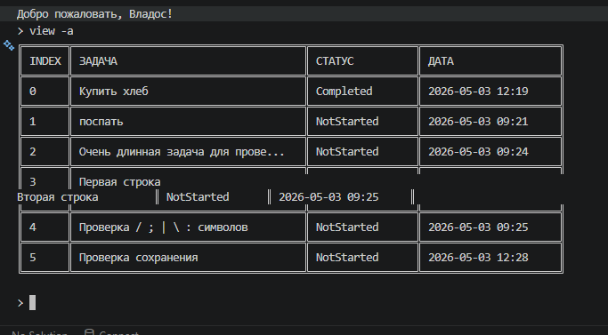

### TC-27 Целостность данных в базе
**Описание:** Проверка наличия базы данных и сохранённых таблиц.

**Предусловия:** Приложение запускалось хотя бы один раз.

**Последовательность действий:**
1. Проверить наличие файла `todos.db`.
2. Запустить приложение.
3. Авторизоваться.
4. Выполнить `view -a`.

**Ожидаемый результат:**
- Файл базы существует.
- Приложение читает данные без ошибок.
- Повреждённые данные не приводят к необработанному исключению.

**Скриншоты:**
- 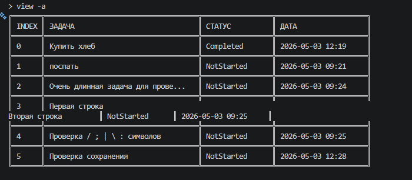

## Парсинг строк

### TC-28 Корректный парсинг кавычек и служебных символов
**Описание:** Проверка парсинга аргументов командной строки.

**Предусловия:** Пользователь авторизован.

**Последовательность действий:**
1. Ввести команду `add "Текст с пробелами / ; | \ :"`.
2. Ввести команду `search --contains "с пробелами"`.

**Ожидаемый результат:**
- Текст внутри кавычек воспринимается как один аргумент.
- Служебные символы сохраняются.
- Поиск находит добавленную задачу.

**Скриншоты:**
- 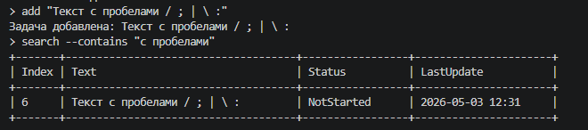

### TC-29 Обработка неизвестной команды и неизвестного флага
**Описание:** Проверка устойчивости парсера.

**Предусловия:** Пользователь авторизован.

**Последовательность действий:**
1. Ввести команду `unknown`.
2. Ввести команду `search --bad-flag`.

**Ожидаемый результат:**
- Для неизвестной команды отображается ошибка команды.
- Для неизвестного флага отображается ошибка команды.
- Программа продолжает работу.

**Скриншоты:**
- 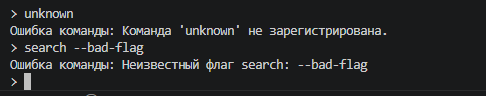

## Undo / Redo

### TC-30 Отмена последнего действия
**Описание:** Проверка команды `undo`.

**Предусловия:** Пользователь авторизован.

**Последовательность действий:**
1. Ввести команду `add "Undo test"`.
2. Ввести команду `undo`.
3. Ввести команду `view -a`.

**Ожидаемый результат:**
- Добавление задачи отменено.
- Задача `Undo test` не отображается в списке.

**Скриншоты:**
- 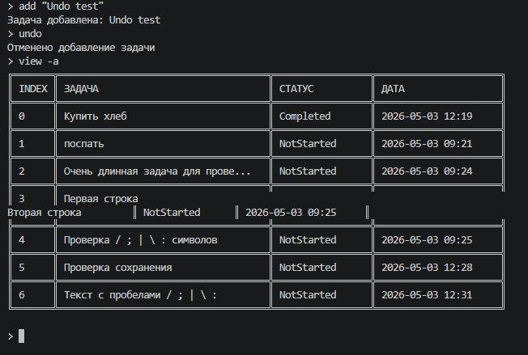

### TC-31 Повтор отменённого действия
**Описание:** Проверка команды `redo`.

**Предусловия:** Выполнен `undo` после добавления задачи.

**Последовательность действий:**
1. Ввести команду `redo`.
2. Ввести команду `view -a`.

**Ожидаемый результат:**
- Отменённое действие повторено.
- Задача снова отображается в списке.

**Скриншоты:**
- 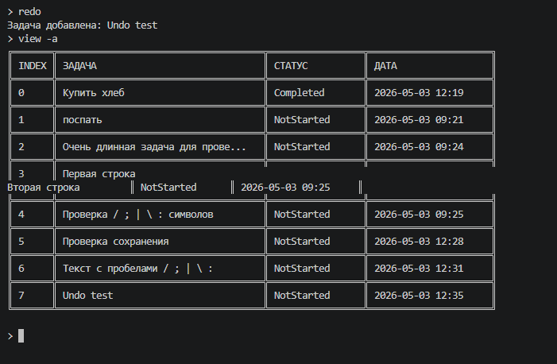

### TC-32 Undo и redo при пустом стеке
**Описание:** Проверка бизнес-ошибок при невозможности отмены или повтора.

**Предусловия:** Нет действий для отмены или повтора.

**Последовательность действий:**
1. Ввести команду `undo`.
2. Ввести команду `redo`.

**Ожидаемый результат:**
- Программа выводит осмысленную ошибку.
- Не возникает необработанного исключения.

**Скриншоты:**
- 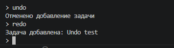

## Дополнительные команды

### TC-33 Имитация параллельной загрузки
**Описание:** Проверка команды `load`.

**Предусловия:** Пользователь авторизован.

**Последовательность действий:**
1. Ввести команду `load 3 100`.

**Ожидаемый результат:**
- В консоли отображаются три прогресс-бара.
- Прогресс-бары обновляются параллельно.
- После завершения отображается сообщение `Все загрузки завершены.`

**Скриншоты:**
- 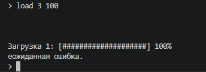

### TC-34 Проверка команды help
**Описание:** Проверка отображения справки по командам.

**Предусловия:** Пользователь авторизован.

**Последовательность действий:**
1. Ввести команду `help`.

**Ожидаемый результат:**
- В консоли отображается список доступных команд.
- Команды соответствуют реализованному функционалу приложения.

**Скриншоты:**
- 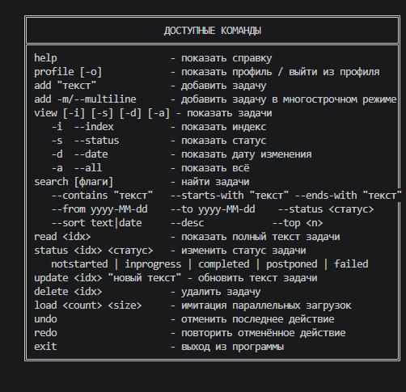
